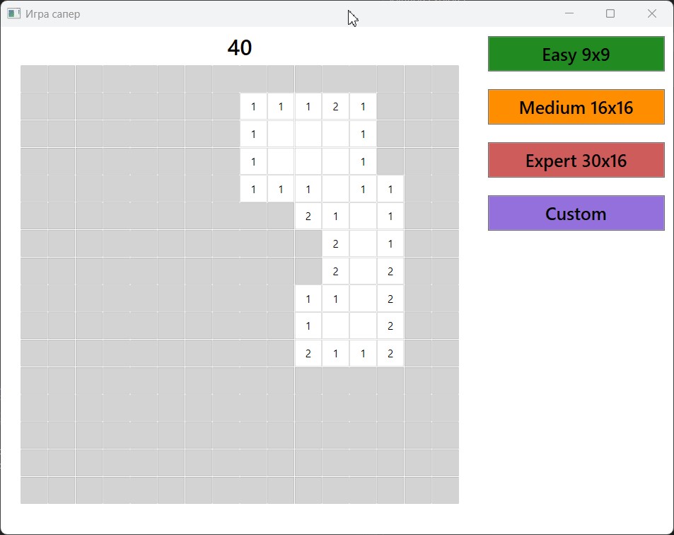
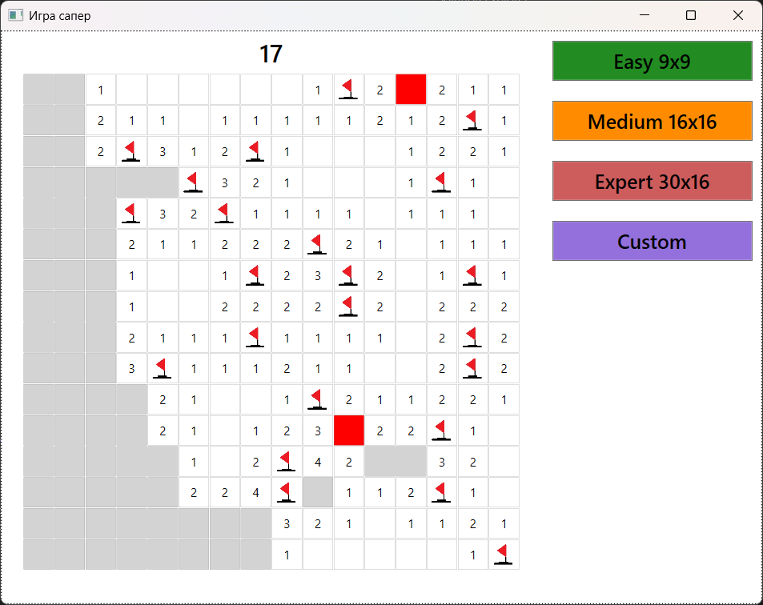

# 💣 Minesweeper


A classic **Minesweeper** desktop game built with **WPF and C#**. Supports three difficulty presets, a custom game mode, and an auto-expanding flood-fill reveal — all in a clean, native Windows desktop experience.





---

## Features

- **Three difficulty levels** — Easy (9×9, 10 mines), Medium (16×16, 40 mines), Expert (30×16, 99 mines)
- **Left-click** to reveal a cell; stepping on a mine ends the game
- **Right-click** to place or remove a flag on a suspected mine
- **Flood-fill reveal** — clicking an empty cell recursively uncovers all connected empty cells and their numbered borders
- **Live mine counter** — shows remaining unflagged mines, updated in real time via data binding
- **Custom game mode** — configure board width, height, and mine count (manual or auto-generated) in a dedicated settings dialog
- **Win detection** — game congratulates you when all mines are correctly flagged

---

## Tech Stack

| | |
|---|---|
| **Language** | C# 7 |
| **Framework** | .NET Framework 4.7.2 |
| **UI** | WPF (Windows Presentation Foundation) |
| **Data binding** | `INotifyPropertyChanged` for live mine counter updates |
| **Algorithm** | Recursive DFS flood-fill for zero-cell propagation |
| **Architecture** | Code-behind with a separate settings dialog window |

---

## Getting Started

### Prerequisites
- Windows OS
- [Visual Studio 2019 or later](https://visualstudio.microsoft.com/) with the **.NET desktop development** workload

### Run
```bash
git clone https://github.com/your-username/minesweeper.git
```
1. Open `WpfApp22/WpfApp22.sln` in Visual Studio
2. Press **F5** to build and run

---

## How to Play

| Action | Result |
|--------|--------|
| Left-click a cell | Reveal it |
| Right-click a cell | Place / remove a flag |
| Flag all mines correctly | Win! |
| Click a mine | Game over |

Use the menu to switch difficulty or open **Custom Settings** to define your own board size and mine count.

---

## License

[MIT](LICENSE) © 2026 Denis Mikhalev